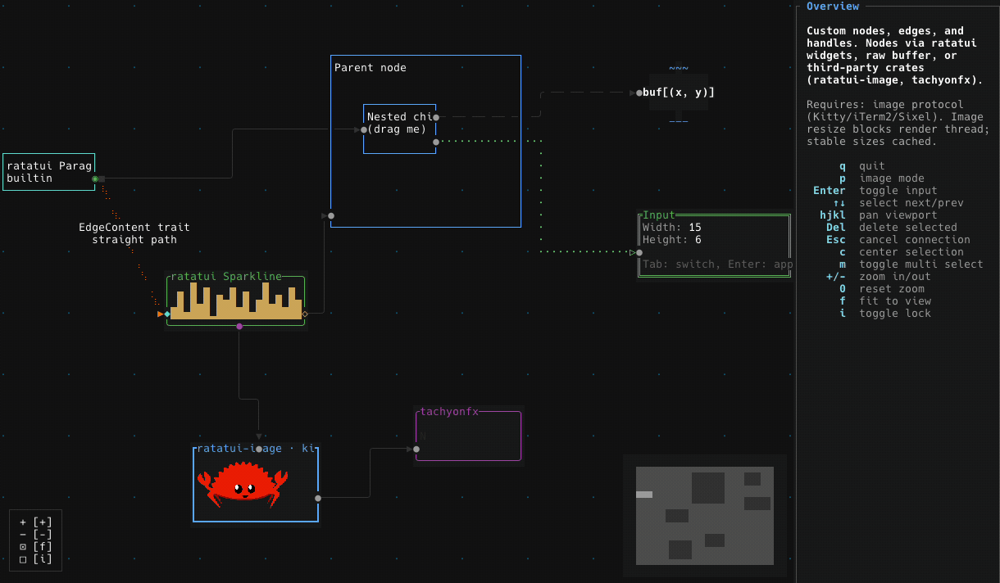

<p align="center">
  
</p>

<h1 align="center">rataflow</h1>

<p align="center">
  <em>Interactive node-based UIs for the terminal.</em>
</p>

<p align="center">
  <a href="https://crates.io/crates/rataflow"></a>
  <a href="https://docs.rs/rataflow"></a>
  <a href="https://crates.io/crates/rataflow"></a>
  <a href="https://github.com/furkankly/rataflow/actions/workflows/ci.yml"></a>
  <a href="https://crates.io/crates/rataflow"></a>
</p>

<p align="center">
  <a href="https://rataflow.furkankly.dev"><b>rataflow.furkankly.dev</b></a> · every example in your browser, the crate itself compiled to WASM
</p>

<p align="center">
  
</p>

rataflow is a library for building node-based UIs in the terminal, from a static diagram to a fully interactive editor. Built on [ratatui](https://github.com/ratatui/ratatui), inspired by [xyflow](https://github.com/xyflow/xyflow) (React Flow).



## Installation

```bash
cargo add rataflow
```

Or add to your `Cargo.toml`:

```toml
[dependencies]
rataflow = "0.1"
```

## Features

**Graph model**
- Generic nodes and edges with custom content types (`NodeContent`, `EdgeContent`)
- Parent/child hierarchies with relative positioning and parent-bounded extents
- Per-node interaction flags: draggable, selectable, deletable, connectable, resizable, hidden, z-index
- Runtime mutation API that keeps layout, hierarchy, and indices consistent
- World-space queries for node bounds, regions, and what sits under a point

**Interaction**
- Pan and zoom (mouse, keyboard, scroll-to-zoom-at-cursor), plus fit-view and center-on-selection
- Mouse dragging to move nodes, create connections, and reconnect existing edges
- Multi-selection with bulk operations, plus box selection on right-drag (or left, via `selection_on_drag`)
- Node resizing from a bottom-right grip
- Keyboard navigation: spatial (arrow keys) and sequential (Tab), fully rebindable via actions
- Auto-pan when dragging near the canvas edge
- Context-menu events for right-clicks on nodes, edges and the pane
- Connection validation with Strict/Loose modes, connectability flags, and custom validators

**Rendering**
- Fully custom node and edge rendering
- Built-in node and edge types: `TextContent`, `StepEdge`, `StraightEdge`, `FloatingEdge`
- Edge routing across all handle positions, plus animated edges and braille strokes for smooth diagonals
- Layering that keeps children above their parents at any nesting depth, and raises the selection
- Crossing edges merge into junction glyphs instead of overwriting each other
- Non-opaque nodes (`opaque`) that let edges and nodes behind them show through
- Off-screen culling, with partially visible nodes still drawing the part that fits
- Companion widgets: Controls, MiniMap, Background
- Runtime theming with Dark, Light, or a custom `Palette`, resolved at render time

**Layout**
- Automatic layered layout via Sugiyama, with configurable direction, spacing, and margins
- Or positions from any external algorithm via `set_node_positions`, available with the built-in layout compiled out

**Integration**
- Backend-agnostic input for crossterm, termion, termwiz, and WASM (via ratzilla)
- Serialization of graph snapshots with serde (undo/redo, save/restore)
- Action/event model where handlers return semantic `FlowEvent`s with no hidden mutations

## Concepts

- **`Flow` is the widget.** Render it with `&mut flow`, forward key and mouse events to it, and read graph state back from it. There's no separate state object to keep in sync.
- **Nodes and edges carry your content.** They're generic over `NodeContent` and `EdgeContent`, so a node holds whatever type you want to draw rather than a fixed shape.
- **Companion widgets wrap a `Flow`.** `Background`, `Controls`, and `MiniMap` borrow a `Flow` and render alongside it.
- **You own the event loop.** `Flow` reacts only to the input you forward, and returns `FlowEvent`s describing what happened. It never mutates the graph behind your back.

## Quick Start

A list of edges is enough to get a graph on screen. Nodes come from the unique
names, positions from the layout, handles from its direction. It's draggable,
pannable and zoomable from the first frame.

```rust,ignore
use rataflow::{Flow, Sugiyama};

let mut flow: Flow = Flow::from_edges(
    &[("Start", "Process"), ("Process", "End")],
    Sugiyama::vertical(),
)?;
```

To say more than that, build the graph yourself. The defaults come apart into
their pieces: your own positions, handles, content types and edge kinds.

```rust,ignore
use rataflow::{Flow, Node, Edge, StepEdge};

// Create nodes with auto-sized text content
let nodes = vec![
    Node::from_text("a", (10.0, 10.0), "Node A"),
    Node::from_text("b", (40.0, 10.0), "Node B"),
];

// Create edges
let edges: Vec<Edge<StepEdge>> = vec![
    Edge::new("e1", "a", "b"),
];

// Create flow (`?` here assumes an enclosing `fn main() -> Result<..>`)
let mut flow = Flow::with_graph(nodes, edges)?;

// Request fit-view (applied at render time)
flow.request_fit_view();

// Render in your draw loop
terminal.draw(|f| {
    f.render_widget(&mut flow, f.area());
})?;
```

The [`examples/`](https://github.com/furkankly/rataflow/tree/main/examples) directory has a runnable demo for every feature. A few starting points:

- `basic`: nodes, edges, and companion widgets together
- `multi_select`: building a selection and acting on it
- `custom_nodes` / `custom_edges`: your own content types
- `custom_layout`: your own positioning algorithm
- `events`: reacting to `FlowEvent`s
- `hierarchy`: parent/child nodes
- `theming`: switching themes at runtime
- `save_restore` / `undo_redo`: serialization with serde

Run any of them with `cargo run --example <name>`.

## Event Handling

Event handlers return an `EventResponse`: `NotHandled`, `Handled`, or `Event(Vec<FlowEvent>)`. A single interaction can produce several events, for example `NodeClicked` followed by `SelectionChanged`:

```rust,ignore
use rataflow::FlowEvent;

for event in flow.handle_mouse_event(mouse.into()).into_events() {
    match event {
        FlowEvent::NodeClicked { node_id } => {
            // Show details, fetch data, etc.
        }
        FlowEvent::ConnectionCompleted(conn) => {
            // Add the edge, then persist to backend, validate, etc.
            flow.add_edge_from_connection(conn, StepEdge::default());
        }
        FlowEvent::SelectionChanged { node_ids, .. } => {
            // Update sidebar with current selection
        }
        _ => {}
    }
}
```

## Under the Hood

A terminal cell grid doesn't give you what a browser does. There's no
compositor, no stacking contexts, and no coordinates for anything drawn past
the screen edge. A few of the pieces this library fills in:

- **Off-screen rendering.** Nodes render into per-node scratch buffers, so
  elements past the top or left edge (which ratatui's u16 buffer can't address)
  still draw correctly.
- **Manual z-ordering.** A hand-rolled `(z_index, insertion_order)` sort with
  xyflow-compatible child-above-parent stacking, in place of DOM z-index.
- **Box-drawing symbol merging.** Crossing edges resolve to proper junction
  glyphs (`┼ ├ ┤`) instead of overwriting each other. Braille edges merge the
  same way, by combining dots within a cell.
- **f64 → i32 → u16 coordinate pipeline.** World-space math stays in floats. A
  signed integer stage handles off-screen clipping before the final u16 cast.

See [`docs/ARCHITECTURE.md`](https://github.com/furkankly/rataflow/blob/main/docs/ARCHITECTURE.md) for the design rationale,
and [`docs/INTERNALS.md`](https://github.com/furkankly/rataflow/blob/main/docs/INTERNALS.md) for how it is implemented.

I've written this up as a series, **Node-based UIs in the terminal**. The first post
covers the whole surface, and the other four each go one level down:

- [Building a node editor on a grid of terminal cells: everything the browser does for you](https://furkankly.dev/posts/node-editor-in-a-terminal)
- [Negative pixels don't exist: three coordinate systems behind a terminal flow graph](https://furkankly.dev/posts/negative-pixels)
- [Rounded turns, sharp crossings: drawing flow-graph edges in a terminal](https://furkankly.dev/posts/box-drawing-edges)
- [Three mouse bytes and a state machine: drag and connect in a terminal](https://furkankly.dev/posts/drag-and-connect)
- [Locked, open, honest: the three contracts of a Rust widget API](https://furkankly.dev/posts/widget-api-three-contracts)

## Event Loop

One operational gotcha: terminal backends deliver every raw mouse event individually (125-1000Hz), unlike browsers, which coalesce mouse moves between frames. During a drag the unprocessed events queue up and the input visibly lags.

Drain all pending events before each render:

```rust,ignore
'main: loop {
    terminal.draw(|f| {
        f.render_widget(&mut flow, area);
    })?;

    // Wait up to 16ms (~60 FPS) for the first event, then drain the rest
    if event::poll(Duration::from_millis(16))? {
        loop {
            match event::read()? {
                Event::Key(key) => {
                    if key.code == KeyCode::Char('q') { break 'main; }
                    flow.handle_key_event(key.into());
                }
                Event::Mouse(mouse) => {
                    for event in flow.handle_mouse_event(mouse.into()).into_events() {
                        match event {
                            FlowEvent::NodeClicked { node_id } => { /* ... */ }
                            _ => {}
                        }
                    }
                }
                _ => {}
            }
            if !event::poll(Duration::ZERO)? { break; }
        }
    }
}
```

All examples use this pattern. See `examples/basic_async.rs` for the tokio equivalent.

## Performance

Benchmarks measure **node dragging**, the hardest sustained operation and the one where frame time turns into visible jank. Each test runs 20 consecutive move-and-render frames. Selection and mounting get no benchmarks of their own, because they are single-frame operations and dragging already covers the sustained case.

The graph topology and size (25x25 chain = 625 nodes, 624 edges) match [xyflow's stress test](https://github.com/xyflow/xyflow/tree/main/examples/react/src/examples/Stress). Frame durations measured via `performance.now()` (WASM/xyflow) and `std::time::Instant` (native). Only the 20 mousemove frames are reported.

```bash
cargo run --release --example stress_test -- --bench        # Headless benchmark (25x25 default)
cargo run --release --example stress_test                   # Interactive (t=drag, a=all, q=quit)
```

### Native

Headless benchmark, 200x60 terminal buffer (a typical fullscreen terminal at 1080p, fixed so numbers compare across machines). Release build, chain topology.

| Nodes  | Edges  | Drag Avg | FPS    |
| ------ | ------ | -------- | ------ |
| 625    | 624    | ~1.0ms   | ~1,000 |
| 10,000 | 9,999  | ~6.6ms   | ~152   |
| 22,500 | 22,499 | ~11.4ms  | ~88    |
| 40,000 | 39,999 | ~18.1ms  | ~55    |

Grid topology (2 edges per node) roughly doubles render time: 37,500 nodes with 74,600 edges averages ~33ms.

### Native vs WASM

At 625 nodes: ~1.0ms vs ~8ms. The ~8x overhead comes from the WebGL2 rendering pipeline and browser frame scheduling.

<details>
<summary>Full WASM scaling data</summary>

| Nodes  | Edges  | Drag Avg | Range   |
| ------ | ------ | -------- | ------- |
| 625    | 624    | ~8ms     | 7-10ms  |
| 2,500  | 2,499  | ~8ms     | 8-9ms   |
| 5,625  | 5,624  | ~8ms     | 7-10ms  |
| 10,000 | 9,999  | ~8ms     | 7-12ms  |
| 22,500 | 22,499 | ~13ms    | 12-15ms |
| 27,889 | 27,888 | ~17ms    | 16-19ms |

</details>

### WASM vs xyflow (React Flow)

rataflow renders to a flat cell buffer on a WebGL2 canvas via [ratzilla](https://github.com/ratatui/ratzilla); xyflow renders to the DOM using React/Svelte. These are fundamentally different rendering architectures, so this isn't a "which is better". It's a concrete illustration of the tradeoffs each approach makes.

625 nodes, 624 edges. Same browser, same window.

| Library             | Avg Frame | Range  | Frames   |
| ------------------- | --------- | ------ | -------- |
| rataflow WASM   | **~8ms**  | 7-10ms | 20/20    |
| xyflow (React Flow) | **~11ms** | 5-30ms | 11-14/20 |

**Scaling.** How many nodes at equivalent frame time:

| Library             | Nodes  | Edges | Avg Frame | Range  |
| ------------------- | ------ | ----- | --------- | ------ |
| xyflow (React Flow) | 625    | 624   | ~11ms     | 5-30ms |
| rataflow WASM   | 10,000 | 9,999 | ~8ms      | 7-12ms |

**16:1.** rataflow WASM handles 10,000 nodes at the frame time xyflow needs for 625.

## Feature Flags

- `crossterm` (default): event conversion for the crossterm backend
- `termion`: event conversion for the termion backend
- `termwiz`: event conversion for the termwiz backend
- `ratzilla`: WebAssembly support via ratzilla
- `sugiyama` (default): automatic graph layout
- `serde`: serialization of graph snapshots

## Contributing

Pull requests are welcome.

- This project follows [Conventional Commits](https://www.conventionalcommits.org/) for all commit messages (e.g. `feat(state): add box selection on right-drag`, `fix(ui): skip orphan edges referencing removed nodes`). The changelog is generated from them with [git-cliff](https://github.com/orhun/git-cliff), and non-conforming commits are dropped.
- Run `cargo fmt`, `cargo clippy` and `cargo test` before opening a PR.

## License

[MIT License](https://github.com/furkankly/rataflow/blob/main/LICENSE)

## Acknowledgements

- [ratatui](https://github.com/ratatui/ratatui) for the terminal UI framework
- [xyflow](https://github.com/xyflow/xyflow) for inspiring the API design
